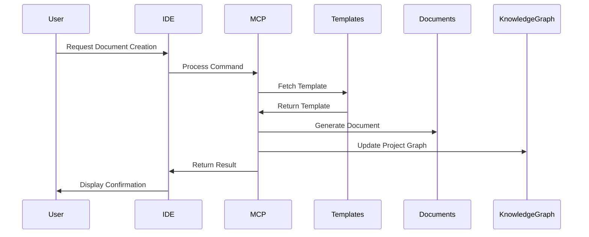

# Architecture for MCP Agile Flow

## Status
Draft

## Technical Summary
This document outlines the architecture for the MCP Agile Flow project, a platform designed to standardize agile workflow management and documentation across different Integrated Development Environments (IDEs). The system follows a modular, extensible architecture that enables consistent template management, document generation, and workflow standardization regardless of the development environment being used.

The architecture employs a Python-based MCP server implementation with IDE-specific adapters, a file-based template system, and a knowledge graph for contextual relationship management. The design prioritizes cross-IDE compatibility, minimal performance impact, and ease of integration with existing development workflows.

## Technology Table
| Technology | Description | Status |
|------------|-------------|--------|
| Python 3.8+ | Core implementation language, offering cross-platform compatibility | ✅ Implemented |
| MCP Protocol | Model Context Protocol for handling IDE interactions | ✅ Implemented |
| Knowledge Graph | In-memory graph database for project entity and relationship tracking | ⚠️ Partial |
| File-based Storage | Template and document storage using standard filesystem operations | ✅ Implemented |
| Markdown | Standard format for all documentation templates and generated content | ✅ Implemented |
| Makefile | Build system for development, testing, and installation workflows | ✅ Implemented |
| Cursor Rules | IDE-specific documentation and command processing for Cursor | ✅ Implemented |
| Cross-IDE Adapters | Integration components for Windsurf, Cline, and Copilot | ✅ Implemented |

## Implementation Status Legend
- ✅ Fully Implemented
- ⚠️ Partially Implemented
- ❌ Not Yet Implemented

## Architectural Diagrams




## Component Descriptions

### 1. Simple Server (simple_server.py) ✅
- Core MCP server implementation
- Command processing and routing
- Template management and document generation
- Project settings and path handling
- IDE command processing
- Unified logging and error handling

### 2. Memory Graph (memory_graph.py) ⚠️
- Entity and relationship storage ✅
- Project knowledge representation ✅
- Document relationship tracking ⚠️
- Semantic search capabilities ❌
- Mermaid diagram generation ✅
- Project type detection ✅

### 3. Rules Migration (rules_migration.py) ✅
- Cross-IDE rules conversion
- Cursor to Windsurf migration
- Template standardization
- Format preservation
- Content validation

### 4. IDE Adapters ✅
- Cursor rule templates and documentation
- Windsurf rules format
- IDE-specific command handling
- Consistent interfaces across IDEs

### 5. Utilities (utils.py) ✅
- Path handling and validation
- Project settings management
- Common helper functions
- Cross-component utilities

## Data Models

### Entity Model ✅
```python
@dataclass
class Entity:
    """An entity in the knowledge graph."""
    name: str
    entity_type: str
    observations: List[str] = field(default_factory=list)
```

### Relation Model ✅
```python
@dataclass
class Relation:
    """A relation between entities in the knowledge graph."""
    from_entity: str
    to_entity: str
    relation_type: str
```

### Knowledge Graph Model ✅
```python
@dataclass
class KnowledgeGraph:
    """The complete knowledge graph structure."""
    entities: List[Entity] = field(default_factory=list)
    relations: List[Relation] = field(default_factory=list)
    project_type: str = "generic"
    project_metadata: Dict[str, Any] = field(default_factory=dict)
```

## Project Structure
```
/
├── src/
│   ├── mcp_agile_flow/                  # Main package
│   │   ├── __init__.py                  # Package initialization
│   │   ├── __main__.py                  # Module entry point
│   │   ├── simple_server.py             # Core MCP server implementation
│   │   ├── memory_graph.py              # Knowledge graph implementation
│   │   ├── register_memory_tools.py     # Knowledge graph tools
│   │   ├── utils.py                     # Utility functions
│   │   ├── rules_migration.py           # Cross-IDE rules migration
│   │   ├── cursor_rules/                # Cursor-specific rules
│   │   │   ├── 000-cursor-rules.md      # Cursor rules management
│   │   │   ├── 001-emoji-communication.md # Communication guidelines
│   │   │   ├── 400-md-docs.md           # Markdown documentation
│   │   │   ├── 800-template-commands.md # Template commands
│   │   │   ├── 900-brd.md               # BRD documentation
│   │   │   ├── 901-prd.md               # PRD documentation
│   │   │   ├── 902-arch.md              # Architecture documentation
│   │   │   ├── 903-story.md             # Story documentation
│   │   │   ├── 904-progress-tracking.md # Progress tracking
│   │   │   └── 905-makefile-usage.md    # Makefile usage
│   │   ├── ide_rules/                   # IDE-specific rules
│   │   │   └── ide_rules.md             # IDE rules documentation
│   │   └── ai-templates/                # Document templates
│   │       ├── template-brd.md          # BRD template
│   │       ├── template-prd.md          # PRD template
│   │       ├── template-arch.md         # Architecture template
│   │       └── template-story.md        # Story template
├── .ai-templates/                       # Source templates
│   ├── template-brd.md                  # BRD template
│   ├── template-prd.md                  # PRD template
│   ├── template-arch.md                 # Architecture template
│   └── template-story.md                # Story template
├── ai-docs/                             # Generated documents
│   ├── brd.md                           # Business Requirements Document
│   ├── prd.md                           # Product Requirements Document
│   ├── arch.md                          # Architecture Document
│   ├── epic-1-git-workflow/             # Git workflow epic (documentation only)
│   └── epic-2-minor-enhancements/       # Minor enhancements epic
├── tests/                               # Test suite
│   ├── archive/                         # Archived tests
│   ├── full-stack-fastapi-sample-project/  # Test sample project
│   └── test_outputs/                    # Test output files
├── run_mcp_server.py                    # Server entry point
├── setup_cursor_mcp.py                  # Cursor setup script
├── check_tools.py                       # Tool validation script
├── pyproject.toml                       # Project configuration
├── setup.py                             # Package setup
├── uv.lock                              # UV lock file
└── Makefile                             # Development automation
```

## Implementation Status

### Completed Features
- Template management system implementation
- Cross-IDE compatibility layer
- File-based storage for templates and documents
- IDE-specific adapters for Cursor, Windsurf, Cline, and Copilot
- Rules migration between IDE formats
- Basic knowledge graph entity and relationship tracking
- Document generation foundation
- Mermaid diagram visualization

### Partially Completed Features
- Document relationship tracking
- Status progression and workflow automation
- Context-aware document linking
- Advanced knowledge graph features

### Pending Features
- Git workflow implementation (Epic-1)
- Semantic search capabilities
- Progress visualization
- Consistency validation for documents
- Advanced document generation automation

## Implementation Approach
1. Implement core MCP server for command processing ✅
2. Create knowledge graph for project relationship tracking ✅
3. Develop template management system ✅
4. Implement cross-IDE rule migration ✅
5. Create document generation capabilities ⚠️
6. Add Cursor rules for IDE integration ✅
7. Implement command handling for workflow management ⚠️

## Security Considerations
- Template validation to prevent injection attacks ✅
- Safe file operations to prevent unauthorized access ✅
- Input sanitization for all user-provided content ✅
- Least privilege principle for file system operations ✅
- Root directory safeguards to prevent unwanted modifications ✅

## Performance Considerations
- Minimal IDE impact through efficient processing ✅
- Lazy loading of templates and documents ✅
- In-memory graph operations ✅
- Caching of frequently accessed data ⚠️
- Efficient path resolution ✅

## Extensibility Points
- Custom template additions ✅
- IDE-specific adapter plugins ✅
- Knowledge graph extension with new entity/relation types ⚠️
- Custom document types ⚠️
- Additional tool integrations ⚠️

## Change Log
| Date | Change | Reason |
|------|--------|--------|
| 2023-03-20 | Initial Architecture | Project design initialization based on BRD and PRD |
| 2023-03-20 | Updated implementation status | Aligning with current codebase implementation |
| 2023-03-20 | Corrected Git workflow implementation status | Fixed incorrect implementation status for Epic-1 features |
| 2023-03-20 | Updated Git workflow to completed status | Implemented commit template, cursor rule, and IDE-agnostic standards |

## Future Architectural Considerations
- Database storage for larger projects
- CI/CD integration for automated testing
- Multi-user collaborative editing
- Advanced analytics for project health
- Machine learning for content suggestions 