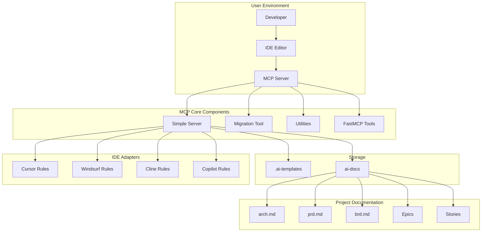

# Architecture for MCP Agile Flow

## Status
Draft

## Technical Summary
This document outlines the architecture for the MCP Agile Flow project, a platform designed to standardize agile workflow management and documentation across different Integrated Development Environments (IDEs). The system follows a modular, extensible architecture that enables consistent template management, document generation, and workflow standardization regardless of the development environment being used.

The architecture employs a Python-based MCP server implementation with IDE-specific adapters and a file-based template system. The design prioritizes cross-IDE compatibility, minimal performance impact, and ease of integration with existing development workflows.

## Technology Table
| Technology | Description | Status |
|------------|-------------|--------|
| Python 3.8+ | Core implementation language, offering cross-platform compatibility | ✅ Implemented |
| MCP Protocol | Model Context Protocol for handling IDE interactions | ✅ Implemented |
| File-based Storage | Template and document storage using standard filesystem operations | ✅ Implemented |
| Markdown | Standard format for all documentation templates and generated content | ✅ Implemented |
| Makefile | Build system for development, testing, and installation workflows | ✅ Implemented |
| Cursor Rules | IDE-specific documentation and command processing for Cursor | ✅ Implemented |
| Cross-IDE Adapters | Integration components for Windsurf, Cline, and Copilot | ✅ Implemented |
| FastMCP | Improved Pythonic interface for MCP tools | ✅ Implemented |

## Implementation Status Legend
- ✅ Fully Implemented
- ⚠️ Partially Implemented
- ❌ Not Yet Implemented

## Architectural Diagrams



## Component Details

### 1. Simple Server (server.py) ✅
- Core MCP server implementation
- Template management and document generation
- Project settings and path handling
- IDE command processing
- Unified logging and error handling

### 2. FastMCP Tools (fastmcp_tools.py, fastmcp_server.py) ✅
- Pythonic interface for MCP tools
- Project settings management
- IDE configuration and initialization
- Context priming and project configuration
- Backward compatibility with MCP tools

### 3. Migration Tool (migration_tool.py) ✅
- Cross-IDE configuration migration
- Smart conflict detection and resolution
- Source and target configuration merging
- Backup creation for safety
- IDE-specific path handling

### 4. IDE Adapters ✅
- Cursor rule templates and documentation
- Windsurf rules format
- IDE-specific command handling
- Consistent interfaces across IDEs

### 5. Utilities (utils.py) ✅
- Path handling and validation
- Project settings management
- Common helper functions
- Cross-component utilities

## Directory Structure

```
mcp-agile-flow/
│
├── ai-docs/                     # Project documentation
│   ├── arch.md                  # Architecture documentation (this file)
│   ├── prd.md                   # Product Requirements Document
│   ├── brd.md                   # Business Requirements Document
│   └── epics/                   # Epic documentation
│
├── src/                         # Source code
│   └── mcp_agile_flow/          # Main package
│       ├── __init__.py          # Package initialization
│       ├── __main__.py          # Script entry point
│       ├── server.py            # Simple server implementation
│       ├── fastmcp_server.py    # FastMCP server implementation
│       ├── fastmcp_tools.py     # FastMCP tool implementations
│       ├── utils.py             # Utility functions
│       ├── migration_tool.py    # Migration tool implementation
│       ├── initialize_ide_rules.py # IDE rules initialization
│       ├── ai-templates/        # AI prompt templates
│       ├── cursor_rules/        # Cursor-specific rules
│       └── ide_rules/           # Cross-IDE rules and templates
│
├── tests/                       # Test suite
│   ├── test_integration.py      # Integration tests
│   ├── test_fastmcp_tools.py    # FastMCP tool tests
│   └── ...                      # Other test files
│
├── scripts/                     # Utility scripts
│   ├── run_mcp_server.py        # Server runner script
│   └── check_tools.py           # Tool validation script
│
├── Makefile                     # Build and test automation
├── pyproject.toml               # Project configuration
└── README.md                    # Project overview
```

## Implementation Status

### Core Functionality
- Basic MCP server implementation ✅
- IDE rule initialization and management ✅
- Project settings management ✅
- Migration tool for cross-IDE support ✅
- FastMCP implementation for Pythonic interface ✅

### Extensions and Future Work
- Additional IDE integrations ⚠️
- More advanced documentation templates ⚠️
- Enhanced AI integration for documentation generation ⚠️

## Note on Memory Graph Functionality
The knowledge graph functionality (entity and relationship tracking, project knowledge representation, and Mermaid diagram generation) has been moved to a separate MCP server. This decision was made to simplify the core MCP Agile Flow implementation and provide better separation of concerns. The core functionality of MCP Agile Flow continues to work without the memory graph. 

Epic 7 (Memory Graph Removal) has been successfully completed, with all integration tests updated to work without the memory graph dependencies. The affected tests have been moved to scripts for manual testing when needed, allowing the main test suite to run reliably without external dependencies. 