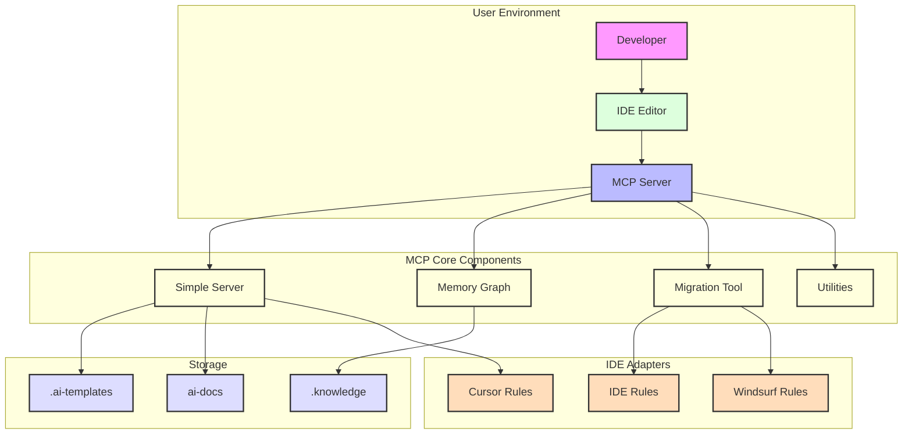
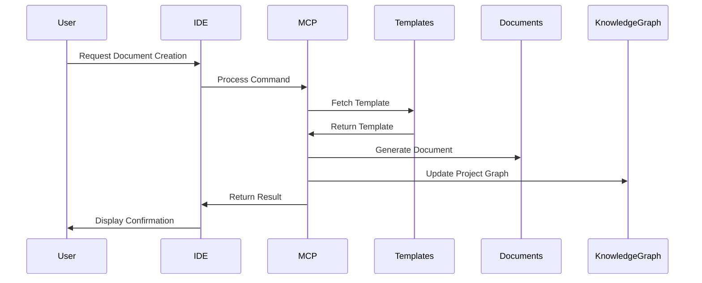

# Architecture for MCP Agile Flow

## Status
Draft

## Technical Summary
This document outlines the architecture for the MCP Agile Flow project, a platform designed to standardize agile workflow management and documentation across different Integrated Development Environments (IDEs). The system follows a modular, extensible architecture that enables consistent template management, document generation, and workflow standardization regardless of the development environment being used.

The architecture employs a Python-based MCP server implementation with IDE-specific adapters, a file-based template system, and a knowledge graph for contextual relationship management. The design prioritizes cross-IDE compatibility, minimal performance impact, and ease of integration with existing development workflows.

## Technology Table
| Technology | Description | Status |
|------------|-------------|--------|
| Python 3.8+ | Core implementation language, offering cross-platform compatibility | ✅ Implemented |
| MCP Protocol | Model Context Protocol for handling IDE interactions | ✅ Implemented |
| Knowledge Graph | In-memory graph database for project entity and relationship tracking | ⚠️ Partial |
| File-based Storage | Template and document storage using standard filesystem operations | ✅ Implemented |
| Markdown | Standard format for all documentation templates and generated content | ✅ Implemented |
| Makefile | Build system for development, testing, and installation workflows | ✅ Implemented |
| Cursor Rules | IDE-specific documentation and command processing for Cursor | ✅ Implemented |
| Cross-IDE Adapters | Integration components for Windsurf, Cline, and Copilot | ✅ Implemented |

## Implementation Status Legend
- ✅ Fully Implemented
- ⚠️ Partially Implemented
- ❌ Not Yet Implemented

## Architectural Diagrams





## Component Descriptions

### 1. Server (server.py) ✅
- Core MCP server implementation
- Command processing and routing
- Template management and document generation
- Project settings and path handling
- IDE command processing
- Unified logging and error handling

### 2. Memory Graph (memory_graph.py) ⚠️
- Entity and relationship storage ✅
- Project knowledge representation ✅
- Document relationship tracking ⚠️
- Semantic search capabilities ❌
- Mermaid diagram generation ✅
- Project type detection ✅

### 3. Migration Tool (migration_tool.py) ✅
- Cross-IDE configuration migration
- Smart conflict detection and resolution
- Source and target configuration merging
- Backup creation for safety
- IDE-specific path handling

### 4. IDE Adapters ✅
- Cursor rule templates and documentation
- Windsurf rules format
- IDE-specific command handling
- Consistent interfaces across IDEs

### 5. Utilities (utils.py) ✅
- Path handling and validation
- Project settings management
- Common helper functions
- Cross-component utilities

## Data Models

### Entity Model ✅
```python
@dataclass
class Entity:
    """An entity in the knowledge graph."""
    name: str
    entity_type: str
    observations: List[str] = field(default_factory=list)
```

### Relation Model ✅
```python
@dataclass
class Relation:
    """A relation between entities in the knowledge graph."""
    from_entity: str
    to_entity: str
    relation_type: str
```

### Knowledge Graph Model ✅
```python
@dataclass
class KnowledgeGraph:
    """The complete knowledge graph structure."""
    entities: List[Entity] = field(default_factory=list)
    relations: List[Relation] = field(default_factory=list)
    project_type: str = "generic"
    project_metadata: Dict[str, Any] = field(default_factory=dict)
```

## Template System Implementation

The template system features a flexible, directory-based approach where:
- All templates are stored in the package's `ai-templates` directory
- During initialization, all files in this directory are automatically copied to the project's `.ai-templates` directory
- No hardcoded list of template files is required, allowing for easy addition/removal of templates
- Only files (not directories) are copied during initialization
- Error handling provides appropriate messaging when templates cannot be copied or the source directory doesn't exist

This design enables the system to adapt to different project requirements without code changes and allows for the addition of new template types without modifying the core codebase.

## Project Structure
```
/
├── src/
│   ├── mcp_agile_flow/                  # Main package
│   │   ├── __init__.py                  # Package initialization
│   │   ├── __main__.py                  # Module entry point
│   │   ├── server.py             # Core MCP server implementation
│   │   ├── memory_graph.py              # Knowledge graph implementation
│   │   ├── migration_tool.py            # Cross-IDE configuration migration
│   │   ├── utils.py                     # Utility functions
│   │   ├── cursor_rules/                # Cursor-specific rules
│   │   │   ├── 000-cursor-rules.md      # Cursor rules management
│   │   │   ├── 001-emoji-communication.md # Communication guidelines
│   │   │   ├── 400-md-docs.md           # Markdown documentation
│   │   │   ├── 800-template-commands.md # Template commands
│   │   │   ├── 900-brd.md               # BRD documentation
│   │   │   ├── 901-prd.md               # PRD documentation
│   │   │   ├── 902-arch.md              # Architecture documentation
│   │   │   ├── 903-story.md             # Story documentation
│   │   │   ├── 904-progress-tracking.md # Progress tracking
│   │   │   └── 905-makefile-usage.md    # Makefile usage
│   │   ├── ide_rules/                   # IDE-specific rules
│   │   │   └── ide_rules.md             # IDE rules documentation
│   │   └── ai-templates/                # Document templates (all copied dynamically)
├── tests/                               # Test suite
│   ├── archive/                         # Archived tests
│   ├── test_mcp_via_agno_agent.py       # Agent-based tests
│   ├── test_mcp_config_migration.py     # Configuration migration tests
│   ├── test_integration.py              # Integration tests
│   └── test_outputs/                    # Test output files
├── Makefile                             # Development automation
├── pyproject.toml                       # Project configuration
└── uv.lock                              # UV lock file
```

## Implementation Status

### Completed Features
- Template management system with dynamic template discovery and copying ✅
- Cross-IDE compatibility layer with adapters for multiple IDEs ✅
- MCP configuration migration with conflict detection and resolution ✅
- File-based storage for templates and documents ✅
- IDE-specific adapters for Cursor, Windsurf, Cline, and Copilot ✅
- Rules migration between IDE formats ✅
- Basic knowledge graph entity and relationship tracking ✅
- Mermaid diagram visualization ✅
- Safe project path handling with root directory protections ✅

### Partially Completed Features
- Document relationship tracking ⚠️
- Status progression and workflow automation ⚠️
- Context-aware document linking ⚠️
- Advanced knowledge graph features ⚠️

### Pending Features
- Semantic search capabilities ❌
- Progress visualization ❌
- Consistency validation for documents ❌
- Advanced document generation automation ❌

## Security Considerations
- Template validation to prevent injection attacks ✅
- Safe file operations to prevent unauthorized access ✅
- Input sanitization for all user-provided content ✅
- Least privilege principle for file system operations ✅
- Root directory safeguards to prevent unwanted modifications ✅

## Performance Considerations
- Minimal IDE impact through efficient processing ✅
- Dynamic template loading eliminating the need for hardcoded lists ✅
- In-memory graph operations ✅
- Efficient path resolution with safety checks ✅
- Backup creation for configuration files before modification ✅

## Extensibility Points
- Custom template additions through direct file addition ✅
- IDE-specific adapter plugins ✅
- Knowledge graph extension with new entity/relation types ⚠️
- Custom document types through template addition ✅

## Architectural Notes on Upcoming Changes

### Memory Graph Removal (Epic-7)
The Memory Graph component is planned for removal from the MCP Agile Flow server in the upcoming Epic-7. This architectural decision was made to:

1. Simplify the core MCP Agile Flow server and focus on its primary functionality
2. Reduce complexity and maintenance burden
3. Allow for the memory graph functionality to be developed independently as a separate MCP server

After removal, the core architecture will focus on template management, document generation, and IDE integration, with improved maintainability and a clearer separation of concerns. The new architecture will not include the Knowledge Graph data models or the memory graph component.

All functionality related to entity and relationship tracking, project knowledge representation, and Mermaid diagram generation will be moved to a dedicated MCP server that can be used independently by teams that require these features.

## Change Log
| Date | Change | Reason |
|------|--------|--------|
| 2023-03-20 | Initial Architecture | Project design initialization based on BRD and PRD |
| 2023-03-20 | Updated implementation status | Aligning with current codebase implementation |
| 2023-03-20 | Corrected Git workflow implementation status | Fixed incorrect implementation status for Epic-1 features |
| 2023-03-20 | Updated Git workflow to completed status | Implemented commit template, cursor rule, and IDE-agnostic standards |
| 2023-03-25 | Integrated MCP Server Specification | Consolidated documentation for better organization |
| 2023-03-27 | Updated Template System Implementation | Documented dynamic template loading approach |
| 2023-03-27 | Updated Component Descriptions | Added Migration Tool details and renamed from Rules Migration |
| 2023-03-27 | Updated Project Structure | Aligned with current file organization |

## Future Architectural Considerations
- Database storage for larger projects
- CI/CD integration for automated testing
- Multi-user collaborative editing
- Advanced analytics for project health
- Machine learning for content suggestions 