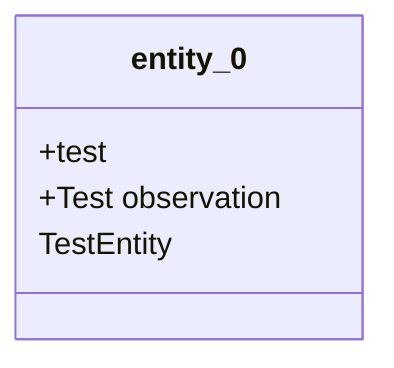

## Knowledge Graph Metadata
- **Project Type**: software
- **Entity Count**: 1
- **Relation Count**: 0
- **Last Updated**: 2025-03-23 16:28:04

### Project Metadata
- **has_python**: Yes
- **has_c_cpp**: Yes
- **software_indicators_count**: 2
- **data_science_indicators_count**: 0