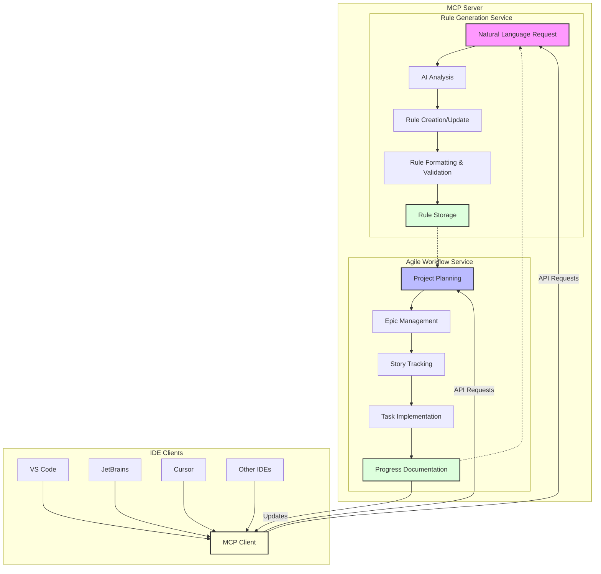

# MCP Automatic Rules Generation with Agile Workflow
# Technical Requirements Document

## Architecture Overview

The MCP Automatic Rules Generation with Agile Workflow is built around two core components exposed through the Model Context Protocol:

1. **Rule Generation Service**: A specialized system that utilizes AI capabilities to automate rule creation and maintenance
2. **Agile Workflow Service**: An integrated structure for organizing and tracking project progress using AI assistance



## System Components

### 1. Rule Generation Service

#### Core Components
- **Natural Language Processor**: Interprets user requests for rule creation/updates
- **Rule Manager**: Handles rule creation, updates, and organization
- **Rule Formatter**: Ensures rules follow standardized format
- **Rule Validator**: Verifies rule structure and content
- **MCP Endpoint Controller**: Exposes rule functionality through MCP protocol

#### Data Storage
- **Rule Database**: Persistent storage for all rules
- **Rule Classification System**:
  - PREFIX categories:
    - 0XX: Core standards
    - 1XX: Tool configs
    - 3XX: Testing standards
    - 1XXX: Language rules
    - 2XXX: Framework rules
    - 8XX: Workflows
    - 9XX: Templates
    - _name: Private rules

#### Rule Composition
- **Rule Metadata**:
  - description: ACTION TRIGGER OUTCOME format (mandatory)
  - scope: Pattern matching for applicability (mandatory)
  - isGlobal: Boolean flag for global application (mandatory)
  - owner: User or team that created the rule
- **Rule Body**:
  - Context section
  - Requirements section
  - Examples section (both valid and invalid)
  - Critical Rules section

### 2. Agile Workflow Service

#### Core Components
- **Project Documentation Manager**: Handles PRD, Architecture, and workflow files
- **Work Item Tracker**: Manages Epics, Stories, Tasks, and Subtasks
- **Status Manager**: Tracks progress through workflow phases
- **Integration Controller**: Coordinates AI assistance with workflow
- **MCP Workflow Controller**: Exposes workflow functionality through MCP protocol

#### Data Storage
- **Project Database**: Stores all project data
- Documentation: Product Requirements, Architecture
- Epic Collections: Organized by project
- Story Documents: Organized by Epic

#### Workflow Phases
- **PLAN Phase**:
  - Focus: Documentation and planning
  - Permitted Changes: Documentation, project structure, rules
  - Requirements: Approvals for PRD and Architecture
- **ACT Phase**:
  - Focus: Implementation of approved in-progress story
  - Approach: Task-by-task execution
  - Requirements: Continuous testing and validation

### 3. MCP Protocol Implementation

#### Core Components
- **API Gateway**: Handles client connections and request routing
- **Authentication Service**: Manages user identity and permissions
- **MCP Endpoint Handler**: Processes MCP protocol messages
- **Event Notification System**: Provides real-time updates to connected clients

#### MCP Endpoints
- **Rule Management**:
  - `createRule`: Create or update a rule
  - `getRule`: Retrieve a rule by ID or criteria
  - `applyRule`: Apply a rule to provided content
  - `listRules`: Get rules matching criteria
- **Workflow Management**:
  - `createWorkItem`: Create Epic/Story/Task
  - `updateWorkItem`: Update status and details
  - `getWorkItem`: Retrieve work item details
  - `listWorkItems`: Get work items matching criteria

### 4. Client Integration

#### Supported Clients
- **IDE Plugins/Extensions**: VS Code, JetBrains, Cursor, others
- **CLI Client**: Command-line interface for non-GUI environments
- **API Client**: Direct API access for custom tooling integration

#### Client Capabilities
- **Rule Application**: Apply rules to code/content
- **Rule Management**: Create, update, list rules
- **Workflow Integration**: Manage Epics, Stories, Tasks
- **AI Interaction**: Communicate with AI through rules

## Technical Requirements

### Rule Generation Requirements

1. **Rule Management**
   - Must expose MCP endpoints for rule CRUD operations
   - Must store rules in a persistent database
   - Must follow naming conventions and classification
   - Must include proper metadata with required fields

2. **Rule Formatting**
   - Must use standardized formatting
   - Must follow established tag usage (example, danger, required)
   - Must support diagrams when appropriate
   - Must maintain DRY (Don't Repeat Yourself) principles

3. **Rule Optimization**
   - Must keep descriptions under 120 characters
   - Must keep rules concise (target: under 50 lines)
   - Must include valid and invalid examples
   - Must use standard scope patterns

4. **Rule Application**
   - Must provide endpoints for applying rules to content
   - Must handle both public and private rules
   - Must ensure rule persistence between sessions
   - Must work with version control systems

### Agile Workflow Requirements

1. **Work Item Management**
   - Must expose MCP endpoints for work item CRUD operations
   - Must maintain proper status progression
   - Must enforce workflow rules (one Epic/Story in progress)
   - Must provide documentation templates

2. **Project Documentation**
   - Must maintain PRD and Architecture documents
   - Must track implementation notes and progress
   - Must support story definition and tracking
   - Must facilitate knowledge retention

3. **Workflow Enforcement**
   - Must enforce phase-specific restrictions
   - Must require proper approvals for transitions
   - Must maintain project focus and consistency
   - Must support integrated task tracking

### MCP Protocol Requirements

1. **API Gateway**
   - Must implement MCP protocol specification
   - Must handle concurrent connections efficiently
   - Must provide authentication and authorization
   - Must maintain session state appropriately

2. **Data Synchronization**
   - Must handle real-time updates to connected clients
   - Must resolve conflicts in concurrent edits
   - Must manage offline/reconnection scenarios
   - Must ensure data integrity

3. **Performance**
   - Must maintain low latency for rule application
   - Must support batched operations for efficiency
   - Must implement appropriate caching mechanisms
   - Must scale to handle multiple team members

### Client Integration Requirements

1. **IDE Extensions**
   - Must provide consistent functionality across IDEs
   - Must handle IDE-specific content models
   - Must integrate with IDE UI elements appropriately
   - Must adapt to IDE-specific constraints

2. **Authentication**
   - Must support secure authentication methods
   - Must manage credentials securely
   - Must implement proper permission models
   - Must handle token refresh and expiration

## Technical Constraints

1. **MCP Protocol Compatibility**
   - Must implement MCP protocol specification
   - Must adapt to protocol version changes
   - Must handle backward compatibility
   - Must extend protocol appropriately for custom functionality

2. **AI Model Requirements**
   - Must work with common AI models (Claude, GPT, etc.)
   - Must adapt to variations in model capabilities
   - Must provide robust error handling
   - Must optimize for model context and token limitations

3. **Deployment Architecture**
   - Must support containerized deployment
   - Must work with common cloud platforms
   - Must support local/self-hosted deployment
   - Must handle database migrations and updates

4. **Security**
   - Must implement secure API access
   - Must protect sensitive project data
   - Must support team-based permissions
   - Must maintain secure connections

## Implementation Details

### Rule Generation Process Flow

1. User submits rule request through IDE client
2. MCP server processes request and invokes AI analysis
3. AI determines rule type and structure
4. Server creates/updates rule in database
5. Server notifies client of successful rule creation

### Agile Workflow Implementation

1. Project initialization with PRD and Architecture
2. Epic planning and management via MCP endpoints
3. Story definition, approval, and tracking
4. Task implementation with AI assistance
5. Progress tracking and documentation

### Server Deployment Options

1. Docker container deployment
2. Cloud-hosted service (AWS, Azure, GCP)
3. Self-hosted on team infrastructure
4. Local development setup

## Testing Requirements

1. **Rule Generation Testing**
   - Test rule creation through various natural language patterns
   - Test rule application across different content types
   - Test rule updating and versioning
   - Test concurrent rule management

2. **Workflow Testing**
   - Test work item progression through complete lifecycle
   - Test workflow rule enforcement
   - Test documentation generation and maintenance
   - Test multi-user workflow interaction

3. **Protocol Testing**
   - Test API endpoint compliance with MCP specification
   - Test error handling and recovery
   - Test performance under load
   - Test cross-IDE compatibility

## Security Considerations

1. **Authentication and Authorization**
   - Implement secure token-based authentication
   - Support role-based access control
   - Protect private rules from unauthorized access
   - Maintain audit logs of security-related events

2. **Data Protection**
   - Encrypt sensitive data at rest and in transit
   - Implement proper backup and recovery procedures
   - Support data isolation between teams/projects
   - Comply with relevant data protection regulations

## Maintenance Guidelines

1. Regular updates to MCP protocol implementation
2. Continuous integration with AI model improvements
3. Active community contribution process
4. Transparent versioning and release management

## Client Integration

To ensure broad compatibility with existing tools and IDEs, the MCP Agile Flow server will support the standard MCP client configuration format.

### MCP Client Configuration Format

The system will support the standard JSON configuration format for MCP clients:

```json
{
  "mcpServers": {
    "agile-flow": {
      "command": "uvx",
      "args": [
        "run",
        "mcp-agile-flow",
        "start"
      ],
      "env": {
        "PROJECT_PATH": "${PROJECT_PATH}"
      }
    }
  }
}
```

### Integration Requirements

1. **Standard I/O Communication**
   - The server must communicate via standard I/O according to the MCP protocol specifications
   - Must handle both JSON input and output properly
   - Must follow MCP standard error handling behavior

2. **Configuration Discovery**
   - Support automatic discovery of `.mcp-config.json` files in project and user directories
   - Honor environment variables specified in the configuration
   - Support dynamic path variables like `${PROJECT_PATH}`

3. **Tool Registration**
   - Register all Agile workflow management tools with clear documentation
   - Include help text and examples for all tools
   - Support tool parameter validation

4. **IDE Integration**
   - Support Cursor IDE configuration
   - Support Claude Desktop configuration
   - Provide extension points for additional IDEs and tools

5. **Session Management**
   - Maintain context across multiple MCP requests in the same session
   - Support project-specific settings and state
   - Allow for context sharing between different clients

## API Response Times

1. **Rule Generation**
   - Maximum response time: 5 seconds
2. **Workflow Management**
   - Maximum response time: 5 seconds
3. **Client Integration**
   - Maximum response time: 5 seconds 