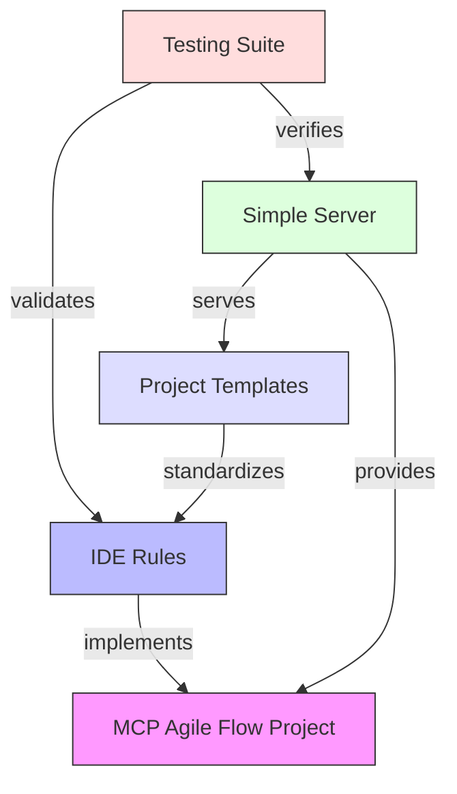

# MCP Agile Flow Project - Knowledge Graph

## Core Components

### MCP Agile Flow Project
- **Type**: Project
- **Description**: Python-based tool for managing agile workflows through MCP
- **Location**: /Users/smian/development/mcp-agile-flow
- **Observations**:
  - Core implementation for IDE integration and workflow management
  - Python-based MCP server implementation
  - Provides tools for agile workflow management

### IDE Rules
- **Type**: Core Feature
- **Description**: Management system for IDE functionality and workflows
- **Observations**:
  - Manages rules for IDE functionality
  - Defines project initialization and workflow rules
  - Supports both development and workflow management

### Simple Server
- **Type**: Component
- **Location**: src/mcp_agile_flow/simple_server.py
- **Observations**:
  - Basic MCP server implementation
  - Entry point for MCP functionality
  - Handles core MCP operations

### Testing Suite
- **Type**: Component
- **Location**: tests/
- **Observations**:
  - Tests IDE rules initialization
  - Tests rule migration between formats
  - Contains integration tests
  - Includes sample project for testing

### Project Templates
- **Type**: Component
- **Observations**:
  - Templates for project documentation
  - Includes architecture (template-arch.md)
  - Contains PRD templates (template-prd.md)
  - Has story templates (template-story.md)
  - Supports multiple IDE formats

## Relationships

1. IDE Rules → MCP Agile Flow Project
   - **Type**: implements
   - **Description**: Core feature implementing project functionality

2. Simple Server → MCP Agile Flow Project
   - **Type**: provides
   - **Description**: Provides MCP server functionality to the project

3. Testing Suite → IDE Rules
   - **Type**: validates
   - **Description**: Ensures correct implementation of IDE rules

4. Project Templates → IDE Rules
   - **Type**: standardizes
   - **Description**: Provides standard formats for IDE rule documentation

5. Simple Server → Project Templates
   - **Type**: serves
   - **Description**: Makes templates available through MCP server

6. Testing Suite → Simple Server
   - **Type**: verifies
   - **Description**: Validates server functionality

## Visualization

