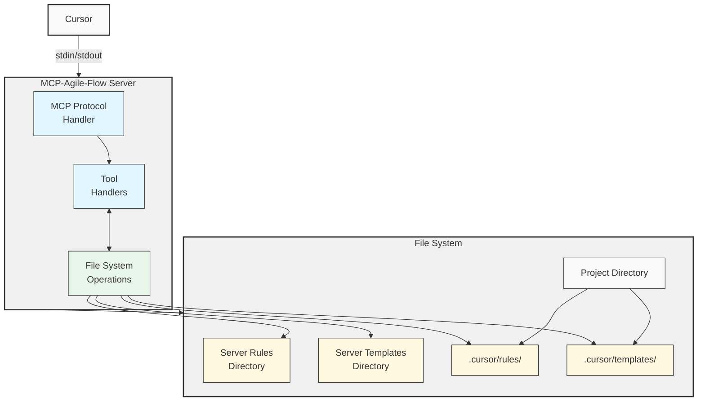
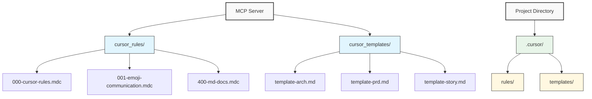
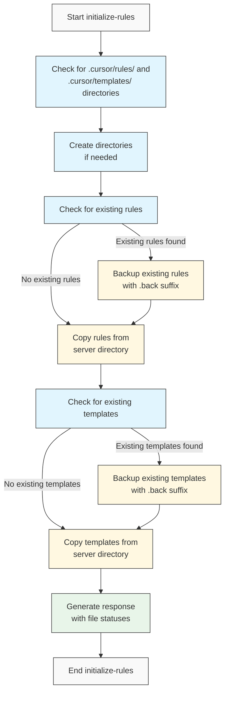
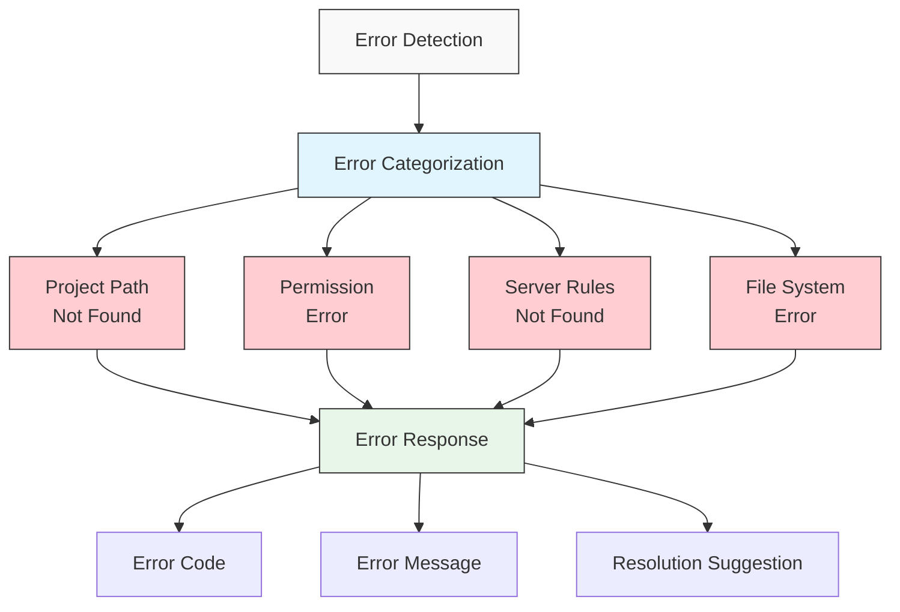

# MCP-Agile-Flow Server Specification (Simplified)

## Overview

MCP-Agile-Flow is an MCP server implementation that handles the initialization and updating of cursor rules. It provides a simple way to set up cursor rules in a project through a file-based system that communicates with Cursor via stdin/stdout using the MCP protocol.

The server will run as a standalone process that handles file operations for copying rules and templates to the correct locations in a project.

## Core Functionality

1. **Rule Initialization**: Copy rule files to the `.cursor/rules/` directory
2. **Template Initialization**: Copy template files to the `.cursor/templates/` directory

## Technical Architecture

The server follows a simple architecture:

1. **MCP Protocol Layer**: Handles communication with Cursor
2. **Tool Handlers**: Process tool invocations
3. **File System Operations**: Copy rule and template files



## MCP Tool Specifications

The server will implement the following MCP tools:

### 1. Rule Management Tools

#### `initialize-rules`

Initializes the project with cursor rules by copying rules from the server's cursor_rules directory to the project's `.cursor/rules/` directory. If rules already exist, they will be backed up with a `.back` suffix.

**Parameters:**
```json
{
  "type": "object",
  "properties": {
    "project_path": {
      "type": "string",
      "description": "Path to the project"
    },
    "backup_existing": {
      "type": "boolean",
      "description": "Whether to back up existing rules",
      "default": true
    }
  },
  "required": ["project_path"]
}
```

**Response:**
```json
{
  "initialized_rules": [
    {
      "file_name": "string",
      "status": "string" // "copied", "backed_up", "skipped"
    }
  ],
  "initialized_templates": [
    {
      "file_name": "string",
      "status": "string" // "copied", "backed_up", "skipped"
    }
  ],
  "success": "boolean"
}
```

**Description:**
- Creates `.cursor/rules/` and `.cursor/templates/` directories if they don't exist
- Backs up existing rule files by renaming them with `.back` suffix if `backup_existing` is true
- Copies all rule files from the server's cursor_rules directory to the project's `.cursor/rules/` directory
- Copies all template files from the server's cursor_templates directory to the project's `.cursor/templates/` directory
- Returns information about which files were copied and backed up

#### `update-rules`

Updates the project's cursor rules by copying rules from the server's cursor_rules directory to the project's `.cursor/rules/` directory. Existing rules will be replaced.

**Parameters:**
```json
{
  "type": "object",
  "properties": {
    "project_path": {
      "type": "string",
      "description": "Path to the project"
    },
    "backup_existing": {
      "type": "boolean",
      "description": "Whether to back up existing rules",
      "default": true
    },
    "specific_rules": {
      "type": "array",
      "items": {"type": "string"},
      "description": "Specific rules to update (if empty, all rules will be updated)"
    }
  },
  "required": ["project_path"]
}
```

**Response:**
```json
{
  "updated_rules": [
    {
      "file_name": "string",
      "status": "string" // "updated", "backed_up", "skipped"
    }
  ],
  "updated_templates": [
    {
      "file_name": "string",
      "status": "string" // "updated", "backed_up", "skipped"
    }
  ],
  "success": "boolean"
}
```

**Description:**
- Creates `.cursor/rules/` and `.cursor/templates/` directories if they don't exist
- Backs up existing rule files by renaming them with `.back` suffix if `backup_existing` is true
- Updates specified rule files (or all if not specified) by copying from the server's cursor_rules directory
- Updates template files similarly to rules
- Returns information about which files were updated and backed up

## Implementation Details

### File System Structure

The server will manage files in the following structure:



### Initialization Process



## Error Handling

The server will handle the following error scenarios:

1. **Project Path Not Found**: When the specified project path doesn't exist
2. **Permission Errors**: When file operations fail due to permission issues
3. **Server Rules Not Found**: When the server's cursor_rules directory is not properly configured
4. **File System Errors**: When other file operations fail



Errors will be returned with:
- Error code
- Error message
- Suggestion for resolution when possible

## Configuration

The server will use a simple configuration file (`mcp-agile-flow.json`) with:

```json
{
  "cursor_rules_dir": "/path/to/cursor/rules",
  "cursor_templates_dir": "/path/to/cursor/templates",
  "log_level": "info",
  "log_file": "/path/to/log"
}
```

## Deployment

The server will be packaged as:

1. **Python Package**: Installable via pip
2. **Standalone Binary**: Downloadable executable

## Next Steps

1. Implement core MCP server with stdin/stdout communication
2. Add file system operations for copying rules and templates
3. Implement the `initialize-rules` tool
4. Implement the `update-rules` tool
5. Create deployment packages 