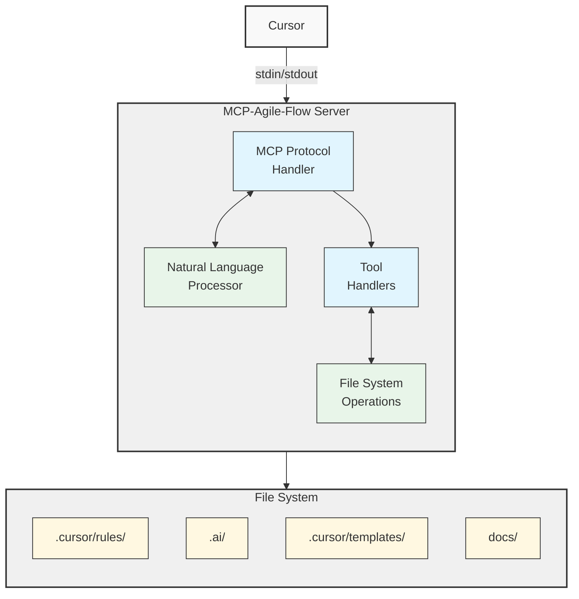
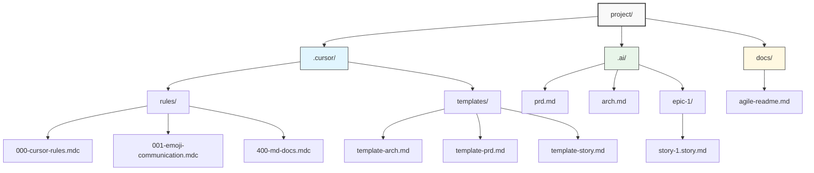
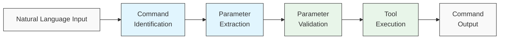
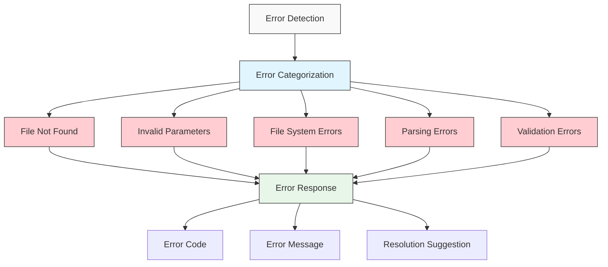

# MCP-Agile-Flow Server Specification

## Overview

MCP-Agile-Flow is an MCP server implementation of the cursor-auto-rules-agile-workflow project. It provides automated rule generation and agile workflow management through a file-based system that communicates with Cursor via stdin/stdout using the MCP protocol.

The server will run as a standalone process that handles file operations for creating, updating, and applying rules to projects, as well as managing templates and agile workflow artifacts.

## Core Functionality

1. **Rule Management**: Create, update, and organize rule files in the `.cursor/rules/` directory
2. **Template Management**: Handle templates in the `.cursor/templates/` directory
3. **Project Initialization**: Set up project structure with appropriate directories and files
4. **Agile Workflow**: Manage epics, stories, tasks, and documentation

## Technical Architecture

The server follows a simple architecture:

1. **MCP Protocol Layer**: Handles communication with Cursor
2. **Tool Handlers**: Process tool invocations and perform operations
3. **File System Operations**: Manage rules, templates, and project files
4. **Natural Language Processing**: Parse commands and generate rules



## MCP Tool Specifications

The server will implement the following MCP tools:

### 1. Rule Management Tools

#### `create-rule`

Creates a new rule file in the `.cursor/rules/` directory.

**Parameters:**
```json
{
  "type": "object",
  "properties": {
    "name": {
      "type": "string",
      "description": "Name of the rule"
    },
    "description": {
      "type": "string",
      "description": "Short description of the rule's purpose"
    },
    "globs": {
      "type": "array",
      "items": {"type": "string"},
      "description": "File patterns the rule applies to"
    },
    "always_apply": {
      "type": "boolean",
      "description": "Whether the rule should always be applied",
      "default": false
    },
    "content": {
      "type": "string",
      "description": "The rule content"
    },
    "natural_language": {
      "type": "string",
      "description": "Natural language description of the rule to generate"
    }
  },
  "required": ["name"]
}
```

**Response:**
```json
{
  "file_path": "string",
  "content": "string",
  "success": "boolean"
}
```

**Description:**
- Takes either explicit rule content or natural language description
- Generates a properly formatted rule file with frontmatter and content
- Names the file using the standard prefix convention
- Places the file in the correct location

#### `update-rule`

Updates an existing rule file.

**Parameters:**
```json
{
  "type": "object",
  "properties": {
    "file_path": {
      "type": "string",
      "description": "Path to the rule file"
    },
    "name": {
      "type": "string",
      "description": "Updated name of the rule"
    },
    "description": {
      "type": "string",
      "description": "Updated description of the rule's purpose"
    },
    "globs": {
      "type": "array",
      "items": {"type": "string"},
      "description": "Updated file patterns the rule applies to"
    },
    "always_apply": {
      "type": "boolean",
      "description": "Updated setting for always apply"
    },
    "content": {
      "type": "string",
      "description": "Updated rule content"
    },
    "natural_language_update": {
      "type": "string",
      "description": "Natural language description of the update to make"
    }
  },
  "required": ["file_path"]
}
```

**Response:**
```json
{
  "file_path": "string",
  "content": "string",
  "success": "boolean"
}
```

**Description:**
- Updates an existing rule file with new content or frontmatter
- Can take natural language instructions for updates
- Preserves existing content if only updating frontmatter

#### `list-rules`

Lists all rule files in the project.

**Parameters:**
```json
{
  "type": "object",
  "properties": {
    "project_path": {
      "type": "string",
      "description": "Path to the project"
    },
    "filter": {
      "type": "string",
      "description": "Filter rules by name or description"
    }
  },
  "required": []
}
```

**Response:**
```json
{
  "rules": [
    {
      "file_path": "string",
      "name": "string",
      "description": "string",
      "always_apply": "boolean"
    }
  ]
}
```

**Description:**
- Lists all rules in the project
- Can filter by name or description
- Returns basic metadata about each rule

#### `apply-rules`

Applies rules to a file or directory.

**Parameters:**
```json
{
  "type": "object",
  "properties": {
    "project_path": {
      "type": "string",
      "description": "Path to the project"
    },
    "target_path": {
      "type": "string",
      "description": "Path to the file or directory to apply rules to"
    }
  },
  "required": ["target_path"]
}
```

**Response:**
```json
{
  "applied_rules": [
    {
      "rule_name": "string",
      "target_file": "string"
    }
  ],
  "success": "boolean"
}
```

**Description:**
- Applies matching rules to the specified file or directory
- Uses glob patterns to determine which rules apply
- Returns information about which rules were applied

### 2. Template Management Tools

#### `create-template`

Creates a new template file.

**Parameters:**
```json
{
  "type": "object",
  "properties": {
    "name": {
      "type": "string",
      "description": "Name of the template"
    },
    "type": {
      "type": "string",
      "description": "Type of template (e.g., 'prd', 'architecture', 'story')",
      "enum": ["prd", "architecture", "story", "custom"]
    },
    "content": {
      "type": "string",
      "description": "The template content"
    }
  },
  "required": ["name", "type", "content"]
}
```

**Response:**
```json
{
  "file_path": "string",
  "content": "string",
  "success": "boolean"
}
```

**Description:**
- Creates a new template file in the `.cursor/templates/` directory
- Formats the template according to type
- Returns the file path and content

#### `list-templates`

Lists all template files.

**Parameters:**
```json
{
  "type": "object",
  "properties": {
    "type": {
      "type": "string",
      "description": "Filter templates by type"
    }
  },
  "required": []
}
```

**Response:**
```json
{
  "templates": [
    {
      "file_path": "string",
      "name": "string",
      "type": "string"
    }
  ]
}
```

**Description:**
- Lists all templates in the project
- Can filter by template type
- Returns basic metadata about each template

#### `apply-template`

Applies a template to create a new file.

**Parameters:**
```json
{
  "type": "object",
  "properties": {
    "template_name": {
      "type": "string",
      "description": "Name of the template to apply"
    },
    "output_path": {
      "type": "string",
      "description": "Path where the file should be created"
    },
    "variables": {
      "type": "object",
      "description": "Template variables to replace"
    }
  },
  "required": ["template_name", "output_path"]
}
```

**Response:**
```json
{
  "file_path": "string",
  "content": "string",
  "success": "boolean"
}
```

**Description:**
- Applies a template to create a new file
- Replaces variables in the template with provided values
- Returns the path and content of the created file

### 3. Project Management Tools

#### `initialize-project`

Initializes a new project with the agile workflow structure.

**Parameters:**
```json
{
  "type": "object",
  "properties": {
    "project_path": {
      "type": "string",
      "description": "Path to the project to initialize"
    },
    "project_name": {
      "type": "string",
      "description": "Name of the project"
    },
    "include_examples": {
      "type": "boolean",
      "description": "Whether to include example files",
      "default": true
    }
  },
  "required": ["project_path", "project_name"]
}
```

**Response:**
```json
{
  "created_directories": ["string"],
  "created_files": ["string"],
  "success": "boolean"
}
```

**Description:**
- Creates the necessary directory structure
- Adds default rule and template files
- Sets up initial agile workflow documents

#### `project-status`

Gets the status of the current project.

**Parameters:**
```json
{
  "type": "object",
  "properties": {
    "project_path": {
      "type": "string",
      "description": "Path to the project"
    }
  },
  "required": []
}
```

**Response:**
```json
{
  "project_name": "string",
  "rule_count": "integer",
  "template_count": "integer",
  "active_epic": "string",
  "active_story": "string",
  "success": "boolean"
}
```

**Description:**
- Returns information about the project's status
- Includes counts of rules and templates
- Identifies the active epic and story

### 4. Agile Workflow Tools

#### `create-epic`

Creates a new epic in the agile workflow.

**Parameters:**
```json
{
  "type": "object",
  "properties": {
    "name": {
      "type": "string",
      "description": "Name of the epic"
    },
    "description": {
      "type": "string",
      "description": "Description of the epic"
    },
    "status": {
      "type": "string",
      "description": "Status of the epic",
      "enum": ["Future", "Current", "Complete"],
      "default": "Future"
    }
  },
  "required": ["name"]
}
```

**Response:**
```json
{
  "file_path": "string",
  "content": "string",
  "success": "boolean"
}
```

**Description:**
- Creates a new epic directory and file
- Sets up the epic with the provided information
- Returns the path and content of the created file

#### `create-story`

Creates a new story within an epic.

**Parameters:**
```json
{
  "type": "object",
  "properties": {
    "name": {
      "type": "string",
      "description": "Name of the story"
    },
    "epic_name": {
      "type": "string",
      "description": "Name of the parent epic"
    },
    "description": {
      "type": "string",
      "description": "Description of the story"
    },
    "status": {
      "type": "string",
      "description": "Status of the story",
      "enum": ["Draft", "In Progress", "Complete"],
      "default": "Draft"
    },
    "story_points": {
      "type": "integer",
      "description": "Estimation in story points",
      "default": 1
    }
  },
  "required": ["name", "epic_name"]
}
```

**Response:**
```json
{
  "file_path": "string",
  "content": "string",
  "success": "boolean"
}
```

**Description:**
- Creates a new story file within the specified epic
- Formats the story according to the template
- Returns the path and content of the created file

#### `update-story-status`

Updates the status of a story.

**Parameters:**
```json
{
  "type": "object",
  "properties": {
    "story_name": {
      "type": "string",
      "description": "Name of the story"
    },
    "epic_name": {
      "type": "string",
      "description": "Name of the parent epic"
    },
    "status": {
      "type": "string",
      "description": "New status of the story",
      "enum": ["Draft", "In Progress", "Complete"]
    }
  },
  "required": ["story_name", "status"]
}
```

**Response:**
```json
{
  "file_path": "string",
  "old_status": "string",
  "new_status": "string",
  "success": "boolean"
}
```

**Description:**
- Updates the status of the specified story
- Returns the old and new status
- Handles any necessary side effects of status changes

### 5. Documentation Tools

#### `create-prd`

Creates a Product Requirements Document (PRD).

**Parameters:**
```json
{
  "type": "object",
  "properties": {
    "project_name": {
      "type": "string",
      "description": "Name of the project"
    },
    "description": {
      "type": "string",
      "description": "Brief description of the project"
    },
    "natural_language": {
      "type": "string",
      "description": "Natural language description of the project for PRD generation"
    }
  },
  "required": ["project_name", "description"]
}
```

**Response:**
```json
{
  "file_path": "string",
  "content": "string",
  "success": "boolean"
}
```

**Description:**
- Creates a PRD file based on the template
- Uses natural language to generate content if provided
- Returns the path and content of the created file

#### `create-architecture`

Creates an Architecture Document.

**Parameters:**
```json
{
  "type": "object",
  "properties": {
    "project_name": {
      "type": "string",
      "description": "Name of the project"
    },
    "tech_stack": {
      "type": "array",
      "items": {"type": "string"},
      "description": "Technologies used in the project"
    },
    "natural_language": {
      "type": "string",
      "description": "Natural language description for architecture generation"
    }
  },
  "required": ["project_name"]
}
```

**Response:**
```json
{
  "file_path": "string",
  "content": "string",
  "success": "boolean"
}
```

**Description:**
- Creates an Architecture Document based on the template
- Uses natural language to generate content if provided
- Returns the path and content of the created file

### 6. Utility Tools

#### `hey-agile-flow`

Processes natural language commands for all functionality.

**Parameters:**
```json
{
  "type": "object",
  "properties": {
    "message": {
      "type": "string",
      "description": "Natural language command"
    }
  },
  "required": ["message"]
}
```

**Response:**
```json
{
  "command": "string",
  "result": "object",
  "success": "boolean"
}
```

**Description:**
- Parses natural language commands
- Routes to the appropriate tool
- Returns the result of the tool invocation

#### `debug-tools`

Gets debug information about recent tool invocations.

**Parameters:**
```json
{
  "type": "object",
  "properties": {
    "count": {
      "type": "integer",
      "description": "Number of recent invocations to show",
      "default": 5
    }
  },
  "required": []
}
```

**Response:**
```json
{
  "invocations": [
    {
      "timestamp": "string",
      "tool": "string",
      "arguments": "object",
      "response_summary": "string"
    }
  ],
  "success": "boolean"
}
```

**Description:**
- Returns information about recent tool invocations
- Useful for debugging and understanding system behavior

## Implementation Details

### File System Structure

The server will manage files in the following structure:



### Rule File Format

Rule files will follow this format:

```
---
description: ACTION when TRIGGER to OUTCOME
globs: .cursor/rules/**/*.mdc
alwaysApply: false
---

# Rule Title

## Context
- When to apply this rule
- Prerequisites or conditions

## Requirements
- Concise, actionable items
- Each requirement must be testable

## Examples
<example>
Good concise example with explanation
</example>

<example type="invalid">
Invalid concise example with explanation
</example>

## Critical Rules
  - Always do X
  - NEVER do Y
```

### Natural Language Processing

The server will use simple pattern matching for natural language commands:

1. **Command Identification**: Identify the tool from the command
2. **Parameter Extraction**: Extract parameters from the command
3. **Validation**: Validate the extracted parameters
4. **Execution**: Route to the appropriate tool handler



Example patterns:
- "create a rule for TypeScript formatting" → `create-rule` with natural language
- "update story User Login to In Progress" → `update-story-status`
- "initialize project My Project" → `initialize-project`

## Error Handling

The server will handle the following error scenarios:

1. **File Not Found**: When a referenced file doesn't exist
2. **Invalid Parameters**: When required parameters are missing or invalid
3. **File System Errors**: When file operations fail
4. **Parsing Errors**: When natural language commands can't be parsed
5. **Validation Errors**: When rule or template content is invalid



Errors will be returned with:
- Error code
- Error message
- Suggestion for resolution when possible

## Configuration

The server will use a simple configuration file (`mcp-agile-flow.json`) with:

```json
{
  "default_project_path": "/path/to/project",
  "log_level": "info",
  "log_file": "/path/to/log",
  "default_templates_dir": "/path/to/templates"
}
```

## Deployment

The server will be packaged as:

1. **Python Package**: Installable via pip
2. **Standalone Binary**: Downloadable executable
3. **Docker Image**: For containerized environments

## Next Steps

1. Implement core MCP server with stdin/stdout communication
2. Add file system operations for rules and templates
3. Implement natural language command processing
4. Add agile workflow management
5. Create deployment packages

## Future Enhancements

1. **Version Control Integration**: Git support for tracking changes
2. **Multiple Editor Support**: Expand beyond Cursor
3. **Rule Sharing**: Repository for sharing rules between projects
4. **Enhanced AI Generation**: Improved rule and template generation
5. **Web UI**: Browser-based management interface 